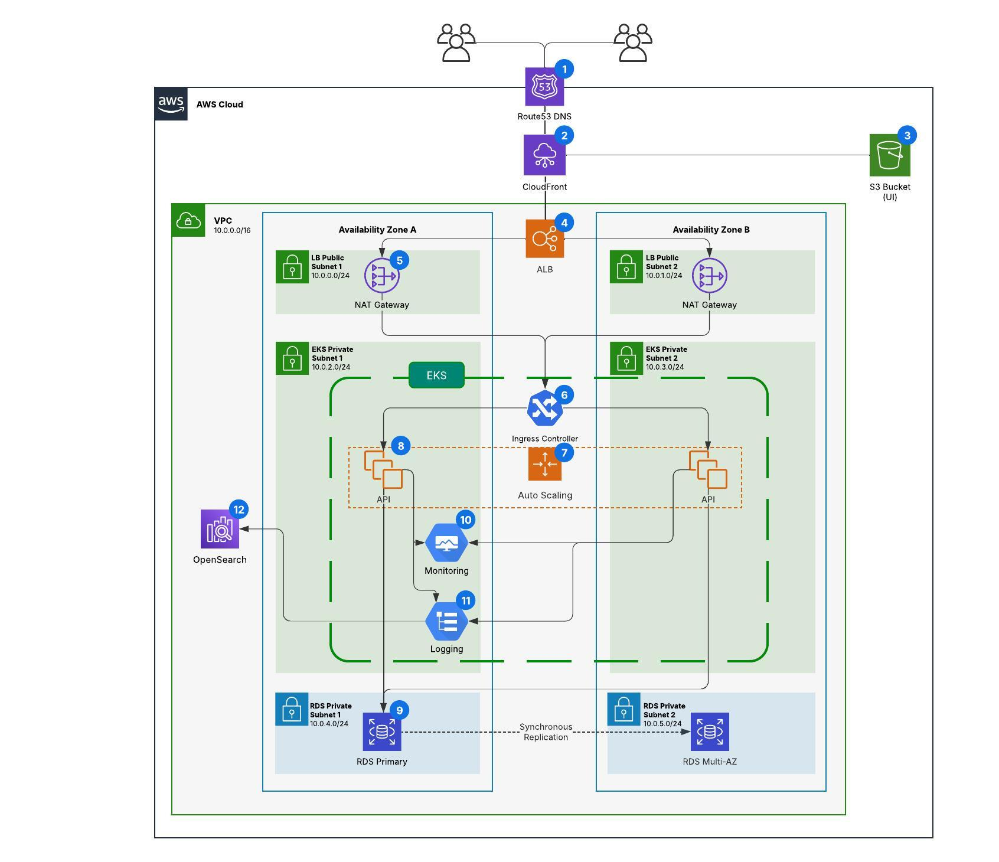

# Overview

Allegro Clone is a demo implementation of a popular Polish e-commerce platform, similar to Amazon. This repository 
aims to provide the necessary cloud resources, networking, and deployment automation to support the entire system, 
ensuring a scalable and consistent infrastructure across all environments, including local, development, and production.

While the infrastructure is under active development, both the [API](https://github.com/emge1/allegro-clone-api)
 and [UI](https://github.com/emge1/allegro-clone-frontend) parts are fully implemented.

## Security information

For security reasons, the full infrastructure code (Terraform, Kubernetes, Helm) is being developed in a private repository and is not available publicly.

This repository contains only safe scaffolding, placeholders, and auto-generated files.  
The README is regularly updated to reflect progress on the infrastructure work.

If you're a recruiter or would like access to the full setup for review purposes, feel free to reach out via email.

# Table of contents
* [Architecture](#architecture)
* [Containerization (Docker)](#containerization--docker-)
  * [Final image sizes](#final-image-sizes-)
  * [Security & Scalability](#security--scalability)
* [Continuous Integration (GitHub Actions)](#continuous-integration--github-actions-)
  * [Security & Reliability](#security--reliability)
* [Continuous Deployment  (GitHub Actions)](#continuous-deployment--github-actions-)
  * [Security & Reliability (planned)](#security--reliability--planned-)
* [Orchestration (Kubernetes & Helm)](#orchestration--kubernetes--helm-)
  * [Security & Scalability (in progress)](#security--scalability--in-progress-)
* [Infrastructure (Terraform & AWS)](#infrastructure--terraform--aws-)
  * [Security & Networking (in progress)](#security--networking--in-progress-)
* [Monitoring & Logging](#monitoring--logging)
  * [Security & Scalability (planned)](#security--scalability--planned-)

# Architecture

This architecture is planned for a production-ready AWS environment based on a containerized, multi-AZ setup. 
Incoming traffic is resolved by **Route 53 (1)**, routed through **CloudFront (2)** to serve **static frontend** 
files **from S3 (3)** or passed to the backend via an **Application Load Balancer (4)** deployed in public subnets. **NAT 
Gateways (5)** are also placed in the public subnets to allow outbound internet access for workloads running in private subnets.

The backend is hosted in a managed EKS cluster spanning two private subnets across separate Availability 
Zones. An **Ingress Controller (6)** routes traffic to **horizontally scalable** (7) API pods (8). Database (PostgreSQL) is hosted 
in **Amazon RDS** (9), configured with Multi-AZ replication. Logs and metrics are processed via internal 
**Monitoring (10)** and **Logging (11)** stacks, with logs shipped to **OpenSearch (12)** (managed by AWS and integrated within 
the same VPC).

In the development environment, EKS is replaced by Minikube, the PostgreSQL database runs as a pod inside the cluster, 
the UI is served from a built Docker image, and application logging is handled through standard output with `DEBUG = True` 
in Django.

# Containerization (Docker)
Application components ([API](https://github.com/emge1/allegro-clone-api)
& [UI](https://github.com/emge1/allegro-clone-frontend)) are containerized using Docker. Dockerfiles were optimized for performance, size, and security using the following techniques:

- **Multi-stage builds**: separating builder and runtime stages to reduce image size and attack surface  
- **Layered copy strategy**: placing frequently changed files later in the build to maximize Docker layer caching  
- **Lightweight base images**: using `slim` variants for backend (easier debugging) and `alpine` for frontend runtime  
- **.dockerignore**: to exclude unnecessary or sensitive files from being included in the build context

## Final image sizes:
- API: **~265 MB** (including sample data)
- UI: **~50 MB**

## Security & Scalability

- Defined `HEALTHCHECK` instructions for container readiness
- Running containers as a non-root user
- `.dockerignore` ensures no secrets or unneeded files are copied into the image

# Continuous Integration (GitHub Actions)
Continuous Integration is handled via GitHub Actions. Pipelines are defined within their respective repositories
([API](https://github.com/emge1/allegro-clone-api), [UI](https://github.com/emge1/allegro-clone-frontend))
triggered on push and pull request events for main branch.

The CI workflow includes:

- **Linting** (*in progress*)  
- **Unit & integration tests** within Dockerized environments  
- **Docker image build & vulnerability scanning** using Trivy
- **Publishing images to DockerHub**
- **Tagged releases** for versioned production artifacts

## Security & Reliability

- Secrets are injected via GitHub Actions secrets
- Scanning Docker images with Trivy
- Branch-based triggers for running workflows
- Tag-based triggers for pushing images to DockerHub

# Continuous Deployment (GitHub Actions)
Separate pipelines will be defined in the respective service repositories to manage deployments across environments.

The **intended** CD process includes:
- **Environment-specific deployments** (dev/staging/prod)  
- **Tagged release triggers**  
- **Helm-based deployments** to Kubernetes clusters for backend services  
- **Static file delivery** to AWS S3 for the UI in production
- Plans for **blue-green or canary deployments** to reduce risk during production rollouts

## Security & Reliability (Planned)

- Secrets to be handled via GitHub Actions environments and encrypted secrets  
- Tag- and environment-based gating for deployment control  
- Manual approvals before production deployments  
- Post-deployment health checks and rollback steps

# Orchestration (Kubernetes & Helm)
Application components are orchestrated using Kubernetes, with Helm charts managing deployment configuration, templating, and environment separation.

Key features:
- **Helm-based deployment** for API (custom chart)  
- Environment-specific values files (dev/staging/prod)
- Dev environment uses in-cluster PostgreSQL and UI *(in progress)*  
- **Ingress Controller** integrated with AWS ALB *(planned)*
- Monitoring components (Prometheus & Grafana) deployed via Helm *(planned)*  
- Logging stack using Loki *(planned)* 
- OpenSearch planned for centralized log storage *(planned)*

## Security & Scalability (in progress)

- API deployed with **readiness/liveness probes**  
- Containers run with **non-root users**  
- **Namespaces** for environment separation
- K8s **RBAC policies and ServiceAccounts** for access isolation *(planned)*   
- **Resource requests & limits** to control consumption *(planned)*  
- **Horizontal Pod Autoscaler** for API *(planned)*  
- TLS termination via AWS ALB with cert-manager *(planned)*  
- NetworkPolicies to restrict internal traffic *(planned)*

# Infrastructure (Terraform & AWS)
The current infrastructure setup was initially designed without Kubernetes in mind and is now being refactored to support a more production-grade environment with EKS and a cloud-native approach.

This infrastructure setup focuses on the **production environment**.

Key features:

- **IAM roles and policies** managed as code
- **VPC, subnets, and security groups** defined via Terraform (security groups *in progress*)
- **Subnet layout**:
  - public subnets for ALB  
  - private subnets for API and RDS
- **S3**:
  - backend for Terraform state (S3 with DynamoDB locking)  
  - production hosting for the frontend (UI build)
- **EKS** as a cluster for the project (API, monitoring, logging, etc. *in progress*)
- **RDS** (Postgres) as the production database (*planned*)
- **Application Load Balancer (ALB)** as entrypoint for external traffic, integrated with K8s Ingress (*planned*)  
- **Terraform workflow** triggered only under specific conditions (tags), with optional manual approvals (**Continuous Delivery**, *planned*)

Moreover, plans also include introducing Ansible and Vagrant for managing local development environments more consistently.

## Security & Networking (in progress)
- Secrets are  managed via **AWS Secrets Manager**, with potential integration into the application or Kubernetes via environment variables  
- SSL certificates managed by **AWS Certificate Manager (ACM)**, attached to ALB and (optionally) CloudFront (*planned*)
- **CloudFront** for UI delivery from S3 — independent of ALB (serves static content, *planned*)  
- **DNS management** via **Route 53**, for domain configuration and routing to ALB or CloudFront (*planned*)

# Monitoring & Logging
Monitoring and logging are planned, with some tooling already deployed but not yet actively configured or used.

Key features (*planned*)
- **Prometheus**, **Grafana**, and **Loki** deployed via Helm  
- Alerting rules & integration with Alertmanager
- Logs collected from API pods  
- OpenSearch integration for long-term log storage  
- Golden signal metrics:
  - latency
  - traffic
  - errors
  - saturation

## Security & Scalability (planned)

- Secure access to Grafana via ingress/auth  
- Limited data retention and log cleanup  
- Internal-only metrics scraping  
- Alert routing and user access control