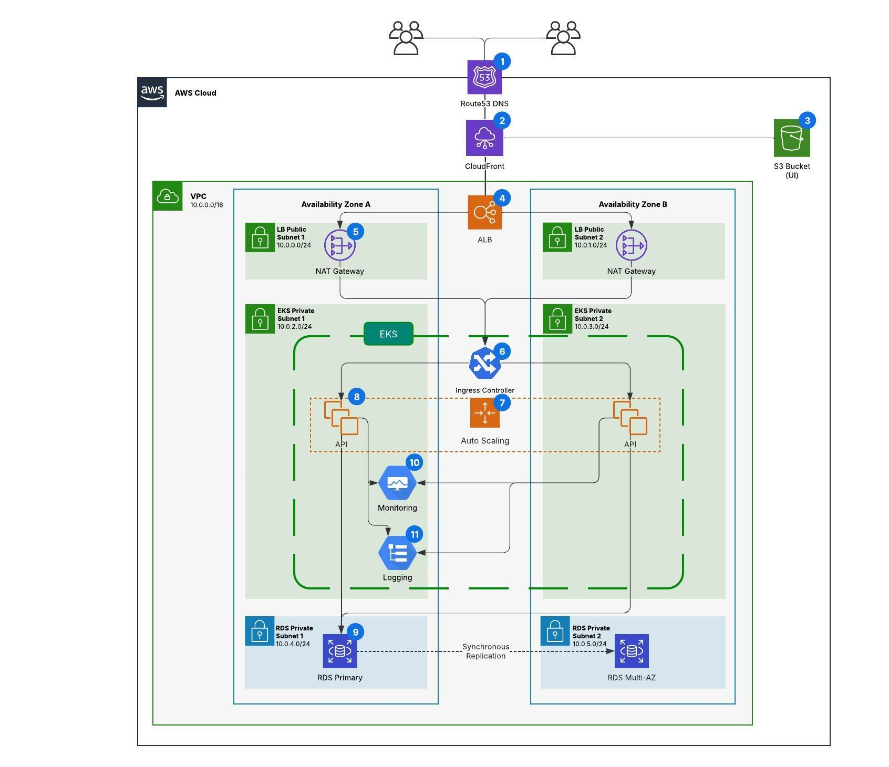
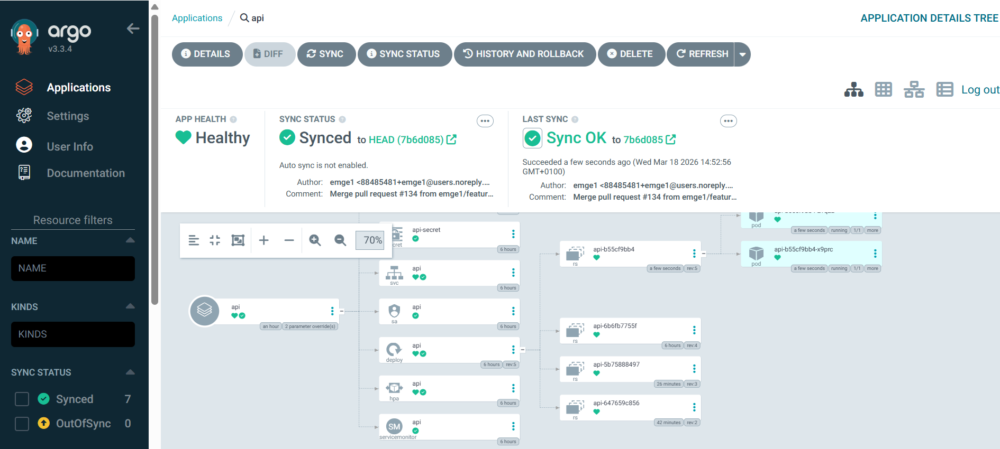
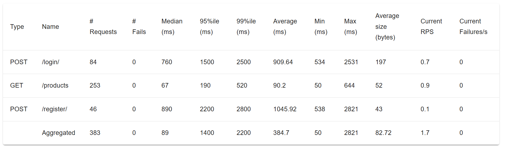
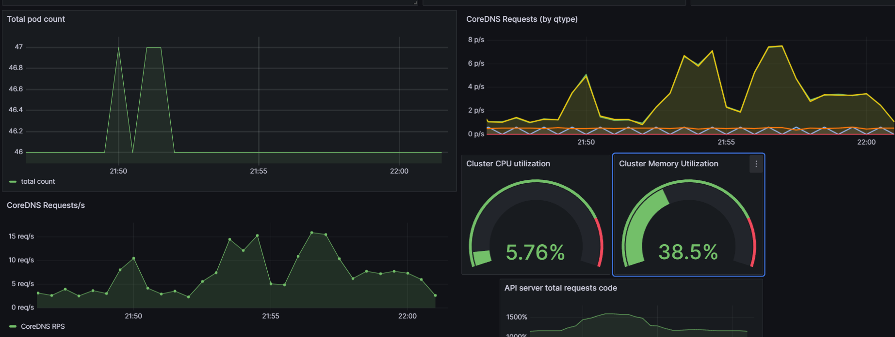

# Cloud Infrastructure Project (AWS / Terraform / Kubernetes)

This project demonstrates a cloud infrastructure for a small-scale application, designed to be cost-efficient initially while supporting future growth.

The platform includes containerized services, infrastructure as code, observability, and load testing.

The full infrastructure code is maintained in a private repository.

## Architecture

**Baseline infrastructure cost** (Infracost): ~$450/month (including VPN)

### Example project decisions
* **EKS instead of ECS** – chosen for greater flexibility and alignment with Kubernetes ecosystem and tooling, despite the higher price

### GitOps (ArgoCD)

### Load test (Locust)
Note: API and database were identified as performance bottlenecks

### Dashboard (Prometheus, Grafana)

### Dockerfile
Optimized images (multi-stage build, slim, .dockerignore). Compressed size: ~70 MB. [Link](https://github.com/emge1/allegro-clone-api/blob/main/Dockerfile)

### CI pipeline
CI/CD: build, test, vulnerability scan, push to DockerHub (tag-based). [Link](https://github.com/emge1/allegro-clone-api/blob/main/.github/workflows/ci.yml)

## Tech Stack
* **Cloud** - AWS (VPC, EKS, RDS, ALB, CloudFront, S3, VPN, IAM, Secrets Manager)

* **Infrastructure as Code** - Terraform

* **Containers & Orchestration** - Docker, Kubernetes, Helm

* **CI/CD** - ArgoCD, GitHub Actions, Trivy

* **Observability** - Prometheus, Grafana

* **Testing** - load testing, Locust, smoke testing

